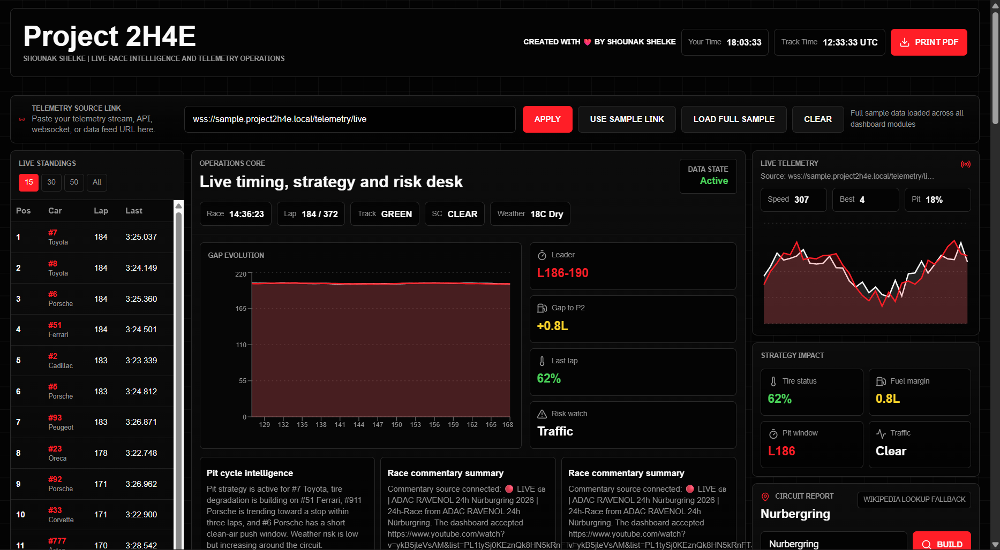
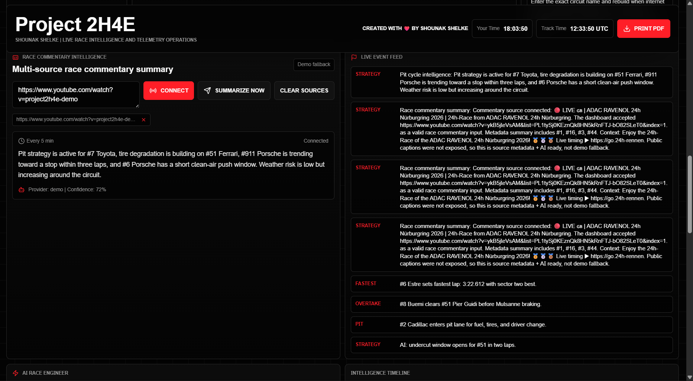
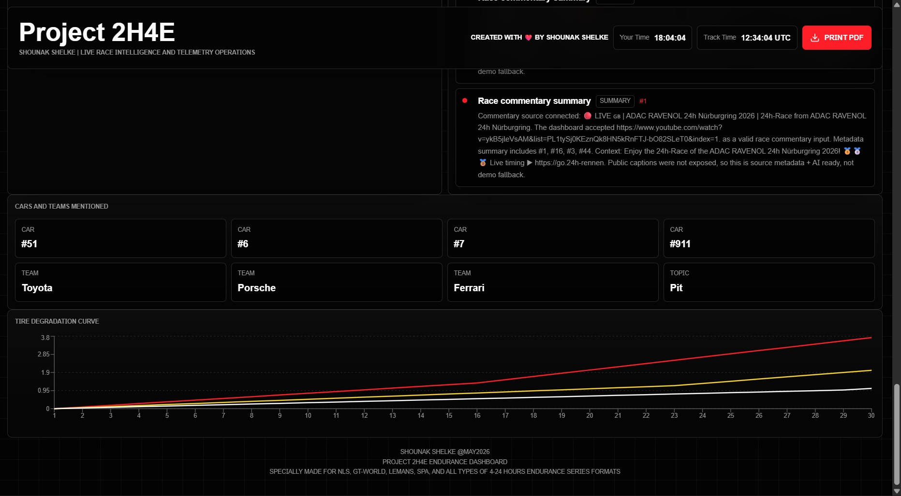

# Project 2H4E Endurance Dashboard

Created with love by Shounak Shelke.

Project 2H4E is a professional endurance-racing command dashboard for live timing, race commentary intelligence, circuit reporting, telemetry-style operations panels, and print-ready race reports. It is designed for NLS, GT-World, Le Mans, Spa, Nürburgring, and other 4-24 hour endurance formats.

## Current Preview







## Product Goals

Project 2H4E turns fragmented race sources into a single operations view:

- Live timing and standings from user-provided telemetry links.
- Race Commentary Intelligence from YouTube and generic commentary/video webpages.
- Circuit reports backed by Wikipedia/Wikimedia and optional Google Programmable Search.
- AI-style summaries, event timelines, car/team mentions, and engineering recommendations.
- One-click sample mode for demos and one-click clear back to a blank dashboard.
- Browser Print PDF output that preserves the black operations-room visual identity.

## Frontend Features

- Blank-by-default startup: no race data appears until the user connects sources or clicks `Load Full Sample`.
- Floating topbar readonly `Your Time`, optional `Track Time`, and `Print PDF`.
- Telemetry source bar with `Apply`, `Use Sample Link`, `Load Full Sample`, and `Clear`.
- Live standings with top 15 / 30 / 50 / all controls.
- Two-row standings comparison modal:
  - Full details for both selected cars.
  - Performance Delta Dashboard.
  - Race Engineering Dashboard.
- Operations Core with race clock, lap, track status, safety-car state, weather, gap evolution, risk, fuel, tire, and strategy calls.
- Race Commentary Intelligence:
  - Multiple commentary links.
  - Source chips and clear controls.
  - Summary timeline and event feed integration.
  - Metadata-backed summaries when captions are not public.
- Circuit Report:
  - Wikipedia/Wikimedia source attribution.
  - Optional Google context.
  - Backend-filtered circuit/map/layout image selection.
  - Zoom In, Zoom Out, Reset, and Change Image controls.
- Print mode:
  - Hides interactive controls.
  - Keeps black background and professional report styling.

## Backend Features

- FastAPI REST backend.
- SQLite persistence.
- Azure live-timing scraper service for user-entered live timing links.
- Commentary source ingestion for YouTube and generic webpages.
- AI summary provider order:
  1. `PROJECT_2H4E_AI_API_URL` + `PROJECT_2H4E_AI_API_KEY`
  2. Groq fallback through `GROQ_API_KEY`
  3. Clearly labeled deterministic fallback
- Circuit report service:
  - Wikipedia search.
  - Wikipedia page summary.
  - Wikimedia image candidate lookup.
  - Rejects logos, flags, posters, cars, badges, and unrelated images.
  - Accepts circuit, track, map, layout, course, route, Nordschleife, and Grand Prix style filenames.
  - `Change Image` endpoint rotates through approved circuit candidates.
- Race-engineering demo modules for tires, fuel, strategy, rivals, telemetry, and AI alerts.

## Tech Stack

Frontend:

- React
- TypeScript
- TanStack Start / Vite
- TailwindCSS
- shadcn/ui
- Recharts
- Lucide icons

Backend:

- Python
- FastAPI
- SQLite
- Pydantic
- WebSockets client support for live timing
- Wikipedia/Wikimedia APIs
- Optional Google Programmable Search
- Optional Groq API fallback

Deployment:

- Local Vite + Uvicorn
- Vercel frontend deployment
- Vercel Python serverless backend deployment
- Long-running host recommended for persistent WebSockets/background loops

## Architecture

```text
Project 2H4E
├─ src
│  ├─ features
│  │  ├─ command-center
│  │  │  └─ Main dashboard, topbar, standings, comparison modal, operations core
│  │  ├─ circuit-report
│  │  │  └─ Circuit report UI, zoom controls, image rotation API client
│  │  ├─ live-intelligence
│  │  │  └─ Commentary links, summaries, timeline, source chips
│  │  └─ race-data
│  │     └─ Sample race data and live-timing API client
│  ├─ components
│  │  ├─ ui
│  │  └─ command
│  └─ lib
│     └─ API base, utilities, error helpers
├─ backend
│  ├─ circuit_report
│  │  └─ Wikipedia/Wikimedia/Google circuit report service
│  ├─ live_intelligence
│  │  └─ Commentary source ingestion and summary generation
│  ├─ live_timing
│  │  └─ Azure live timing scraper and normalized standings
│  ├─ race_engineering
│  ├─ telemetry
│  ├─ strategy_engine
│  ├─ fuel_models
│  ├─ tire_models
│  └─ rival_analysis
├─ api
│  └─ Vercel serverless FastAPI entry
└─ docs
   └─ Screenshots and deployment notes
```

## Main API Interfaces

Live timing:

- `POST /api/live-timing/source`
- `GET /api/live-timing/status`
- `GET /api/live-timing/standings`
- `POST /api/live-timing/scrape-now`
- `POST /api/live-timing/clear`

Race Commentary Intelligence:

- `POST /api/commentary/sources`
- `GET /api/commentary/status`
- `GET /api/commentary/summaries`
- `POST /api/commentary/summarize-now`
- `POST /api/commentary/clear`

Circuit Report:

- `POST /api/circuits/report`
- `GET /api/circuits/report/latest`
- `POST /api/circuits/report/change-image`

Race engineering:

- `GET /api/engineering/telemetry`
- `GET /api/engineering/tires`
- `GET /api/engineering/fuel`
- `GET /api/engineering/strategy`
- `GET /api/engineering/rivals`
- `GET /api/engineering/ai-alerts`
- `GET /api/engineering/pit-window`
- `GET /api/engineering/degradation`
- `GET /api/engineering/battles`

## Environment

Frontend:

```bash
VITE_PROJECT_2H4E_API_BASE=http://127.0.0.1:8000
```

Backend:

```bash
GROQ_API_KEY=
GROQ_MODEL=llama-3.1-8b-instant
PROJECT_2H4E_AI_API_URL=
PROJECT_2H4E_AI_API_KEY=
GOOGLE_API_KEY=
GOOGLE_CSE_ID=
PROJECT_2H4E_CORS_ORIGINS=http://127.0.0.1:5173,http://localhost:5173
```

## Local Run

Backend:

```bash
cd backend
pip install -r ../requirements.txt
uvicorn main:app --reload
```

Frontend:

```bash
npm install
npm run dev -- --host 127.0.0.1
```

Open:

```text
http://127.0.0.1:5173
```

## Verification

```bash
npm run format
npm run lint
npm run build
python -m compileall backend api
```

## Credits

Shounak Shelke @May2026  
email: Shelkeshounak1@gmail.com
Project 2H4E Endurance Dashboard  
Specially Made for NLS, GT-World, LeMans, Spa, and all types of 4-24 hours Endurance series Formats
