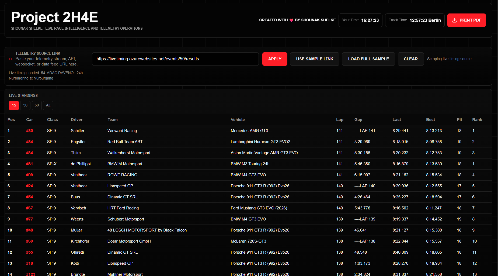
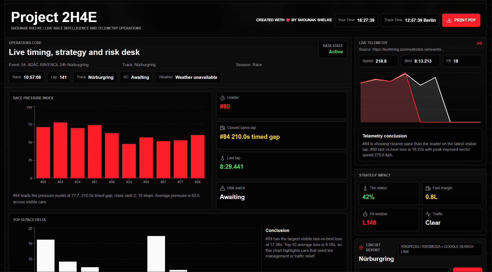
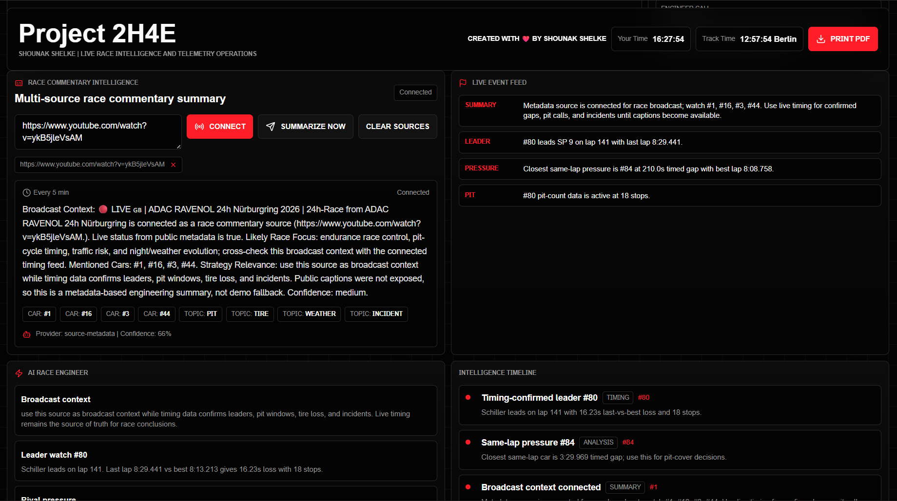
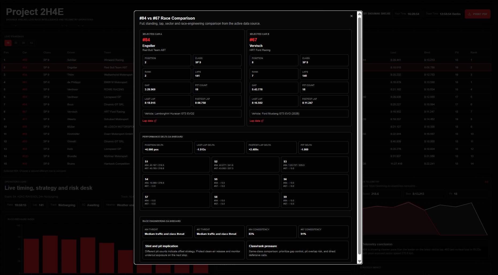
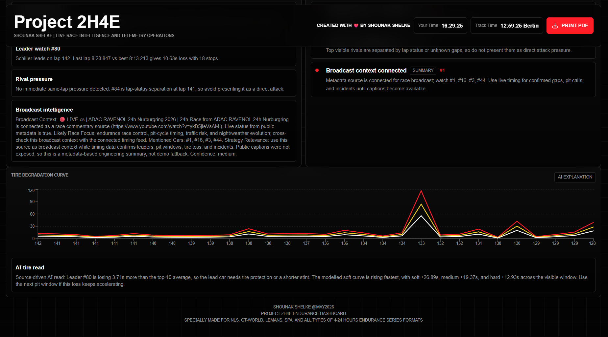

# Project 2H4E Endurance Dashboard

Created with love by Shounak Shelke.

Project 2H4E is a professional endurance-racing command dashboard for live timing, race commentary intelligence, circuit reporting, telemetry-style operations panels, and print-ready race reports. It is designed for NLS, GT-World, Le Mans, Spa, Nurburgring, and other 4-24 hour endurance formats.

## Current Preview











## Architecture

```text
Project 24H- Endurance Dashboard
|-- frontend/
|   |-- src/
|   |-- package.json
|   |-- vite.config.ts
|   |-- tsconfig.json
|   |-- vercel.json
|   `-- .env.example
|-- backend/
|   |-- main.py
|   |-- api/
|   |-- live_timing/
|   |-- live_intelligence/
|   |-- circuit_report/
|   |-- race_engineering/
|   |-- requirements.txt
|   `-- vercel.json
|-- docs/
|   |-- DEMO_GUIDE.md
|   |-- RUN_GUIDE.md
|   |-- DEPLOYVERCEL.md
|   |-- BACKEND_ARCHITECTURE.md
|   |-- BACKEND_README.md
|   `-- assets/screenshots/
|-- README.md
|-- run_project.bat
`-- .gitignore
```

## Product Goals

- Convert live timing, commentary, and circuit context into one motorsport operations interface.
- Stay blank until the user connects real sources or clicks `Load Full Sample`.
- Keep sample mode clearly separated from real source-driven data.
- Support portfolio demos and local race-engineering workflow from one button.
- Deploy frontend and backend independently on Vercel.

## Frontend Features

- React, TypeScript, TanStack Start, Vite, TailwindCSS, shadcn/ui, Recharts, and Lucide icons.
- Fixed floating topbar with `Project 2H4E`, Shounak Shelke credit, readonly `Your Time`, optional `Track Time`, and `Print PDF`.
- Telemetry source controls: `Apply`, `Use Sample Link`, `Load Full Sample`, and `Clear`.
- Live standings with 15 / 30 / 50 / all list controls.
- Two-row standings comparison modal with performance deltas and race-engineering analysis.
- Race Commentary Intelligence for YouTube and generic commentary/video webpage links.
- Entity mention cards that show all unique cars, teams, and topics from source data.
- Tire Degradation Curve with an AI-style explanation derived from the visible data.
- Black-background print mode for PDF-ready race reports.

## Backend Features

- FastAPI backend with SQLite persistence.
- Live timing scraper for Azure timing URLs, including:
  - `https://livetiming.azurewebsites.net/events/50/results`
  - legacy `event=50` URL shapes
- Continuous live timing refresh after a source is configured.
- YouTube commentary metadata extraction for:
  - `https://www.youtube.com/watch?v=ykB5jleVsAM`
- Commentary summaries through primary AI, Groq fallback, or labeled deterministic fallback.
- Wikipedia/Wikimedia circuit reports for user-entered circuits such as `Nurburgring`.
- Backend-filtered circuit image candidates and `Change Image` rotation.
- Race engineering endpoints for telemetry, tires, fuel, strategy, rivals, pit windows, degradation, battles, and AI alerts.

## Main API Interfaces

Live timing:

- `POST /api/live-timing/source`
- `GET /api/live-timing/status`
- `GET /api/live-timing/standings`
- `POST /api/live-timing/scrape-now`
- `POST /api/live-timing/clear`

Race Commentary Intelligence:

- `POST /api/commentary/sources`
- `GET /api/commentary/status`
- `GET /api/commentary/summaries`
- `POST /api/commentary/summarize-now`
- `POST /api/commentary/clear`

Circuit Report:

- `POST /api/circuits/report`
- `GET /api/circuits/report/latest`
- `POST /api/circuits/report/change-image`

## Local Run

One-click Windows launcher:

```bat
run_project.bat
```

Manual backend:

```bash
cd backend
pip install -r requirements.txt
python -m uvicorn main:app --host 127.0.0.1 --port 8000 --reload
```

Manual frontend:

```bash
cd frontend
npm install
npm run dev -- --host 127.0.0.1
```

Open:

```text
http://127.0.0.1:5173
```

## Environment

Frontend `.env` in `frontend/`:

```bash
VITE_PROJECT_2H4E_API_BASE=http://127.0.0.1:8000
```

Backend environment:

```bash
GROQ_API_KEY=
GROQ_MODEL=llama-3.1-8b-instant
PROJECT_2H4E_AI_API_URL=
PROJECT_2H4E_AI_API_KEY=
GOOGLE_API_KEY=
GOOGLE_CSE_ID=
PROJECT_2H4E_CORS_ORIGINS=http://127.0.0.1:5173,http://localhost:5173
```

## Verification

```bash
cd frontend
npm run format
npm run lint
npm run build

cd ../backend
python -m compileall .
```

## Documentation

- [Demo Guide](docs/demo.md)
- [Run Guide](docs/run_guide.md)
- [Project Report](docs/project_report.md)
- [Vercel Deployment Guide](docs/DEPLOYVERCEL.md)
- [Backend Architecture](docs/BACKEND_ARCHITECTURE.md)
- [Backend README](docs/BACKEND_README.md)

## Credits

Shounak Shelke @May2026  
email: Shelkeshounak1@gmail.com  
Project 2H4E Endurance Dashboard  
Specially Made for NLS, GT-World, LeMans, Spa, and all types of 4-24 hours Endurance series Formats
